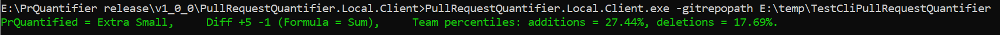
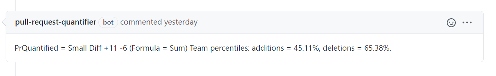

# Pull Request Quantifier


A highly customizable tool to quantify a pull request within a repository context.

## Clients
#### Local

[Download latest local client](https://github.com/microsoft/PullRequestQuantifier/releases)
```
PullRequestQuantifier.Local.Client.exe /?
```
Bellow example will show a change quantified.


#### GitHub
Bellow example will show a comment on a pull request.


#### Visual Studio Extension
[Download latest visual studio extension](https://github.com/microsoft/PullRequestQuantifier/releases)

After installing the extention, quantifier will diplay the output on visual studio status bar.


## Context customization

-TODO explain each setting

[Download latest vesion of conntext generator and run it.](https://github.com/microsoft/PullRequestQuantifier/releases)

```yml
Included: 
Excluded:
- '*.csproj'
GitOperationType:
- Add
- Delete
Thresholds:
- GitOperationType:
  - Add
  - Delete
  Value: 9
  Label: Extra Small
  Color: Green
  Formula: Sum
- GitOperationType:
  - Add
  - Delete
  Value: 29
  Label: Small
  Color: Green
  Formula: Sum
- GitOperationType:
  - Add
  - Delete
  Value: 99
  Label: Medium
  Color: Yellow
  Formula: Sum
- GitOperationType:
  - Add
  - Delete
  Value: 499
  Label: Large
  Color: Red
  Formula: Sum
- GitOperationType:
  - Add
  - Delete
  Value: 999
  Label: Extra Large
  Color: Red
  Formula: Sum
LanguageOptions:
  IgnoreSpaces: true
  IgnoreComments: true
  IgnoreCodeBlockSeparator: true
DynamicBehaviour: false
AdditionPercentile:
  1: 12.302839279174805
  2: 17.981073379516602
  3: 22.082019805908203
  ...(auto generated when we run the context generator)
DeletionPercentile:
  1: 17.69230842590332
  2: 34.615386962890625
  ...(auto generated when we run the context generator)
```

## Developing

PullRequestQuantifier uses `netstandard2.1` for the main library(PullRequestQuantifier.Client) and `net5.0` for the unit tests (Xunit).

#### Build

From the root directory

```
dotnet build .\PullRequestQuantifier.sln
```

#### Test

From the root directory

```
dotnet test .\PullRequestQuantifier.sln
```

## Contributing

This project welcomes contributions and suggestions.  Most contributions require you to agree to a
Contributor License Agreement (CLA) declaring that you have the right to, and actually do, grant us
the rights to use your contribution. For details, visit https://cla.opensource.microsoft.com.

When you submit a pull request, a CLA bot will automatically determine whether you need to provide
a CLA and decorate the PR appropriately (e.g., status check, comment). Simply follow the instructions
provided by the bot. You will only need to do this once across all repos using our CLA.

This project has adopted the [Microsoft Open Source Code of Conduct](https://opensource.microsoft.com/codeofconduct/).
For more information see the [Code of Conduct FAQ](https://opensource.microsoft.com/codeofconduct/faq/) or
contact [opencode@microsoft.com](mailto:opencode@microsoft.com) with any additional questions or comments.

## Trademarks

This project may contain trademarks or logos for projects, products, or services. Authorized use of Microsoft 
trademarks or logos is subject to and must follow 
[Microsoft's Trademark & Brand Guidelines](https://www.microsoft.com/en-us/legal/intellectualproperty/trademarks/usage/general).
Use of Microsoft trademarks or logos in modified versions of this project must not cause confusion or imply Microsoft sponsorship.
Any use of third-party trademarks or logos are subject to those third-party's policies.
