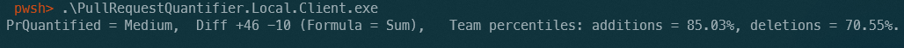
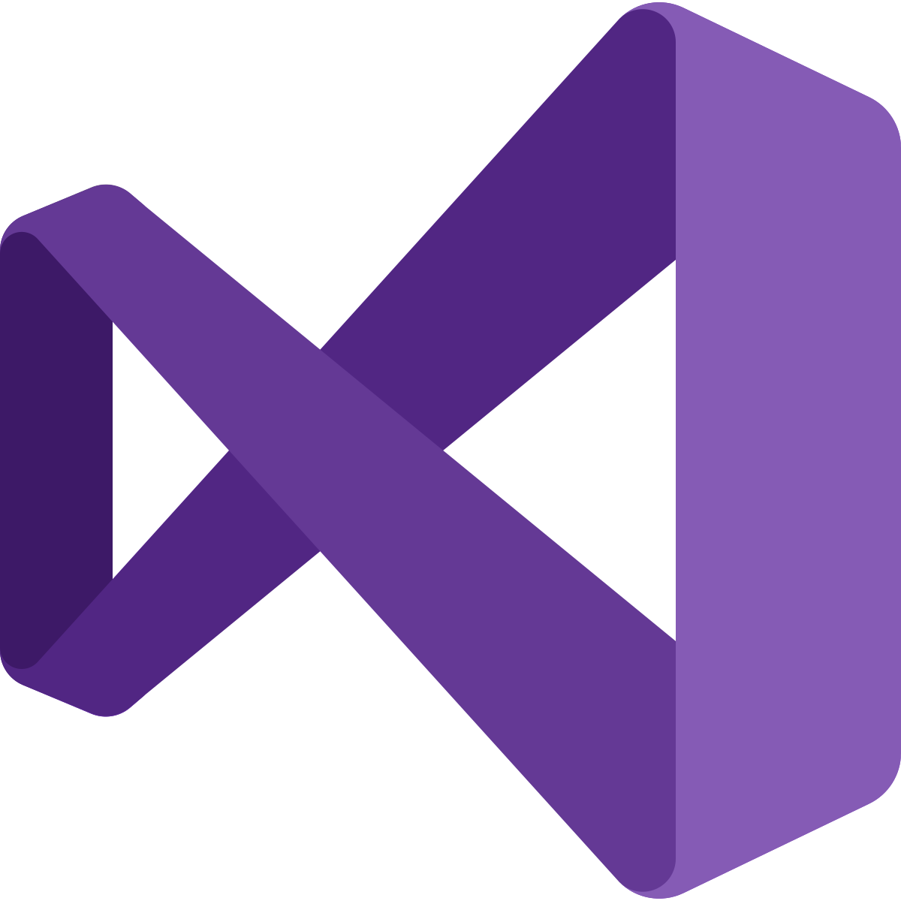
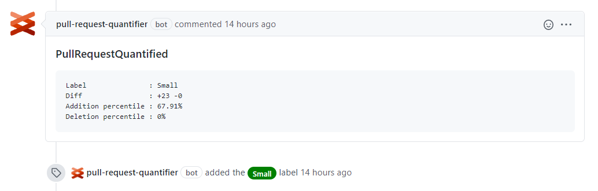

# Pull Request Quantifier


A highly customizable framework to quantify a pull request within a repository context.

Highlights

- Counts pull request changes with high accuracy
- Provides customizations through a yaml file for fine grained control over change counts
- Uses git history to provide a repository level context to the pull request

##
<details open>
  <summary display="inline"> <strong>Pull request optimization good practices</strong> </summary>
  <p/>
  <p/>
  
##### Why small changes matter:
```
1. Time to review.
2. Bugs are more likely to be detected.
3. Respect other people's time.
4. Share knowledge efficiently, small portions can always be assimilated better.
5. Release fast to production, small changes are always more likely to be released faster.
6. Exercise your mind to divide big problems into smaller ones.
```

##### What can I do to optimize my changes:
```
1. Quantify your PR accurately: exclude files that are not necessary 
   to be reviewed (autogenerated, docs, project IDE settings files, binaries ...).
   Check Excluded section from your .prquantifier file.
2. Split your problem into subproblems and try to code towards them.
3. Don't refactor and code new features at the same time.
```
##### How to interpret git diff:
```
1. One line was added: +1 -0
2. One line was deleted: +0 -1
3. One line was modified: +1 -1 
(git diff doesn't know about modified, will 
interpret that line like one addition plus one deletion)
```
</details>

## 

<details open>
  <summary display="inline"> <strong>Clients</strong> </summary>
<p/>
  <p/>
 The following open source clients are supported:

| - | Name | Example |
|------|------|---------|
| <a href="./src/Clients/PullRequestQuantifier.Local.Client"></a>  | [CLI](./src/Clients/PullRequestQuantifier.Local.Client) |  |
| <a href="./src/Clients/PullRequestQuantifier.Vsix.Client"></a>  | [Visual Studio](./src/Clients/PullRequestQuantifier.Vsix.Client) |  |
| <a href="./src/Clients/PullRequestQuantifier.GitHub.Client"></a>  | [GitHub](./src/Clients/PullRequestQuantifier.GitHub.Client) |  |


</details>


##

<details>
  <summary display="inline"> <strong>How to develop new clients</strong> </summary>
  <p/>
  <p/>
Three steps

1. Load the context, if available
1. Call Quantifier
1. Output the results

```c#
// 1. point to the context file (with behavior specification)
var contextFile = "path/to/context/file/.prquantifier";

// 2. quantify local git repository

var quantifyClient = new QuantifyClient(contextFile);
var quantifierResult = await quantifyClient.Compute("path/to/local/git/repo");

// 3. output the results
Console.WriteLine(quantifierResult.Label);
Console.WriteLine(quantifierResult.QuantifiedLinesAdded);
Console.WriteLine(quantifierResult.QuantifiedLinesDeleted);
```

</details>

## 


<details>
  <summary display="inline"> <strong>Context customization</strong> </summary>
  <p/>
  <p/>
  -TODO explain each setting

[Download latest vesion of conntext generator](https://github.com/microsoft/PullRequestQuantifier/releases) and run it from the command line inside a git repository.

 

Simple context file:

```yml
Thresholds:
- Value: 10
  Label: Extra Small
  Color: Green
- Value: 40
  Label: Small
  Color: Green
- Value: 100
  Label: Medium
  Color: Yellow
- Value: 400
  Label: Large
  Color: Red
- Value: 1000
  Label: Extra Large
  Color: Red
```

More detailed context file:

```yml
Included: 
Excluded:
- '*.csproj'
GitOperationType:
- Add
- Delete
Thresholds:
- GitOperationType:
  - Add
  - Delete
  Value: 9
  Label: Extra Small
  Color: Green
  Formula: Sum
- GitOperationType:
  - Add
  - Delete
  Value: 29
  Label: Small
  Color: Green
  Formula: Sum
- GitOperationType:
  - Add
  - Delete
  Value: 99
  Label: Medium
  Color: Yellow
  Formula: Sum
- GitOperationType:
  - Add
  - Delete
  Value: 499
  Label: Large
  Color: Red
  Formula: Sum
- GitOperationType:
  - Add
  - Delete
  Value: 999
  Label: Extra Large
  Color: Red
  Formula: Sum
LanguageOptions:
  IgnoreSpaces: true
  IgnoreComments: true
  IgnoreCodeBlockSeparator: true
DynamicBehaviour: false
AdditionPercentile:
  1: 12.302839279174805
  2: 17.981073379516602
  3: 22.082019805908203
  ...(auto generated when we run the context generator)
DeletionPercentile:
  1: 17.69230842590332
  2: 34.615386962890625
  ...(auto generated when we run the context generator)
```
</details>

## 

<details>
  <summary display="inline"> <strong>Developing</strong> </summary>
  <p/>
  <p/>
  PullRequestQuantifier uses `netstandard2.1` for the main library(PullRequestQuantifier.Client) and `net5.0` for the unit tests (Xunit).
</details>

##

<details>
  <summary display="inline"> <strong>Build</strong> </summary>
  <p/>
  <p/>
  From the root directory

```
dotnet build .\PullRequestQuantifier.sln
```
</details>

##

<details>
  <summary display="inline"> <strong>Test</strong> </summary>
  <p/>
  <p/>
  From the root directory

```
dotnet test .\PullRequestQuantifier.sln
```
</details>

## 

<details>
  <summary display="inline"> <strong>Contributing</strong> </summary>
  <p/>
  <p/>
  This project welcomes contributions and suggestions.  Most contributions require you to agree to a
Contributor License Agreement (CLA) declaring that you have the right to, and actually do, grant us
the rights to use your contribution. For details, visit https://cla.opensource.microsoft.com.

When you submit a pull request, a CLA bot will automatically determine whether you need to provide
a CLA and decorate the PR appropriately (e.g., status check, comment). Simply follow the instructions
provided by the bot. You will only need to do this once across all repos using our CLA.

This project has adopted the [Microsoft Open Source Code of Conduct](https://opensource.microsoft.com/codeofconduct/).
For more information see the [Code of Conduct FAQ](https://opensource.microsoft.com/codeofconduct/faq/) or
contact [opencode@microsoft.com](mailto:opencode@microsoft.com) with any additional questions or comments.
</details>


## 

<details>
  <summary display="inline"> <strong>Trademarks</strong> </summary>
  <p/>
  <p/>
This project may contain trademarks or logos for projects, products, or services. Authorized use of Microsoft 
trademarks or logos is subject to and must follow 
[Microsoft's Trademark & Brand Guidelines](https://www.microsoft.com/en-us/legal/intellectualproperty/trademarks/usage/general).
Use of Microsoft trademarks or logos in modified versions of this project must not cause confusion or imply Microsoft sponsorship.
Any use of third-party trademarks or logos are subject to those third-party's policies.
</details>


