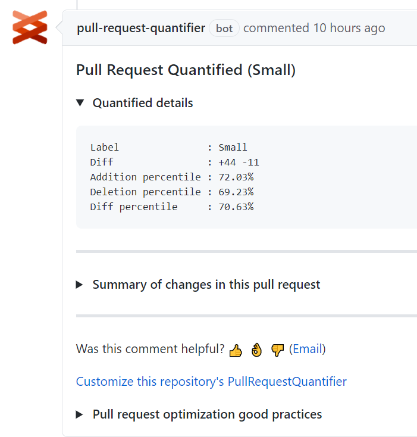
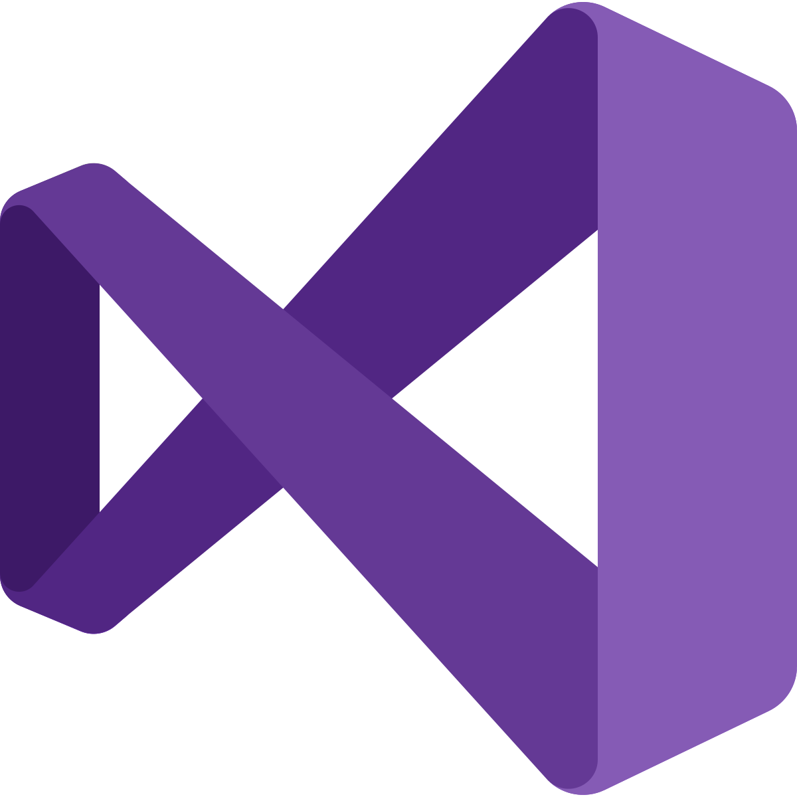
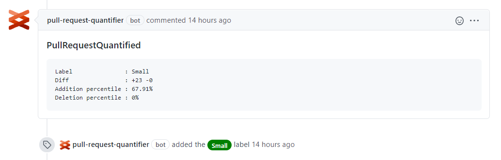
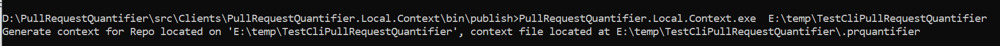

# Pull Request Quantifier @microsoft-github-policy-service terminate


[](https://codecov.io/gh/microsoft/PullRequestQuantifier)

A highly **customizable framework** to quantify a pull request within a repository
context **to drive a optimal PR experience**.

[Install our free GitHub App](https://github.com/marketplace/pull-request-quantifier)

<span><a href="https://github.com/marketplace/pull-request-quantifier"></a></span>

[VSCode extension](https://marketplace.visualstudio.com/items?itemName=ms-1es.pull-request-quantifier)

### Highlights

- Counts pull request changes with high accuracy
- Uses git history to provide a repository level context to the pull request
- Provides customizations through a yaml file for fine grained behavior control

### Prerequisites

- [.NET 5.0 runtime](https://dotnet.microsoft.com/en-us/download/dotnet/5.0) is required for the framework to work properly.

#

<details open>
  <summary display="inline"> <strong>Why proper sizing of changes matters</strong> </summary>
  <p/>
  <p/>  

Optimal pull request sizes drive a better predictable PR flow as they strike a
balance between between PR complexity and PR review overhead. PRs within the
optimal size (typical small, or medium sized PRs) mean:

- Fast and predictable releases to production: 
  - Optimal size changes are more likely to be reviewed faster with fewer
  iterations. 
  - Similarity in low PR complexity drives similar review times. 
- Review quality is likely higher as complexity is lower:
  - Bugs are more likely to be detected.
  - Code inconsistencies are more likely to be detected.
- Knowledge sharing is improved within the participants:
  - Small portions can be assimilated better.
- Better engineering practices are exercised:
  - Solving big problems by dividing them in well contained, smaller problems.
  - Exercising separation of concerns within the code changes.

#### What can I do to optimize my changes

- Use the PullRequestQuantifier to quantify your PR accurately
  - Create a context profile for your repo using the [context generator](https://github.com/microsoft/PullRequestQuantifier/releases)
  - Exclude files that are not necessary to be reviewed or do not increase the
  review complexity. 
  Example: Autogenerated code, docs, project IDE setting files, binaries, etc.
  Check out the `Excluded` section from your `prquantifier.yaml` context profile.
  - Understand your typical change complexity, drive towards the desired complexity
  by adjusting the label mapping in your `prquantifier.yaml` context profile. 
  - Only use the labels that matter to you, [see context specification](./docs/prquantifier-yaml.md)
  to customize your `prquantifier.yaml` context profile.
- Change your engineering behaviors
  - For PRs that fall outside of the desired spectrum, review the details and check
  if:
    - Your PR could be split in smaller, self-contained PRs instead
    - Your PR only solves one particular issue. (For example, don't refactor and
    code new features in the same PR).

#### How to interpret the change counts in git diff output

- One line was added: `+1 -0`
- One line was deleted: `+0 -1`
- One line was modified: `+1 -1` (git diff doesn't know about modified, it will
interpret that line like one addition plus one deletion)
- Change percentiles: Change characteristics (addition, deletion, modification)
of this PR in relation to all other PRs within the repository.

</details>

## 

<details open>
  <summary display="inline"> <strong>Clients</strong> </summary>
<p/>
  <p/>
 The following open source clients are supported:

| - | Name | Example |
|------|------|---------|
| <a href="./src/Clients/PullRequestQuantifier.Local.Client"></a>  | [CLI](./src/Clients/PullRequestQuantifier.Local.Client) |  |
| <a href="./src/Clients/PullRequestQuantifier.Vsix.Client"></a>  | [Visual Studio](./src/Clients/PullRequestQuantifier.Vsix.Client) |  |
| <a href="./src/Clients/PullRequestQuantifier.GitHub.Client"></a>  | [GitHub](./src/Clients/PullRequestQuantifier.GitHub.Client) |  |


</details>


##

<details>
  <summary display="inline"> <strong>How to develop new clients</strong> </summary>
  <p/>
  <p/>
Three steps

1. Load the context, if available
1. Call Quantifier
1. Output the results

```c#
// 1. point to the context file (with behavior specification)
var contextFile = "path/to/context/file/prquantifier.yaml";

// 2. quantify local git repository

var quantifyClient = new QuantifyClient(contextFile);
var quantifierResult = await quantifyClient.Compute("path/to/local/git/repo");

// 3. output the results
Console.WriteLine(quantifierResult.Label);
Console.WriteLine(quantifierResult.QuantifiedLinesAdded);
Console.WriteLine(quantifierResult.QuantifiedLinesDeleted);
```

</details>

## 


<details>
  <summary display="inline"> <strong>Context customization</strong> </summary>
  <p/>
  <p/>
  
  See [context specification](./docs/prquantifier-yaml.md) for details of the yaml-based customization.

[Download latest version of context generator](https://github.com/microsoft/PullRequestQuantifier/releases) and run it from the command line inside a git repository.

 

</details>

## 

<details>
  <summary display="inline"> <strong>Developing</strong> </summary>
  <p/>
  <p/>
  PullRequestQuantifier uses `netstandard2.1` for the main library(PullRequestQuantifier.Client) and `net5.0` for the unit tests (Xunit).

[Coding guidelines](./docs/CSharpCodingGuidelines.md)
</details>

##

<details>
  <summary display="inline"> <strong>Build</strong> </summary>
  <p/>
  <p/>
  From the root directory

```
dotnet build .\PullRequestQuantifier.sln
```
</details>

##

<details>
  <summary display="inline"> <strong>Test</strong> </summary>
  <p/>
  <p/>
  From the root directory

```
dotnet test .\PullRequestQuantifier.sln
```
</details>

## 

<details>
  <summary display="inline"> <strong>Contributing</strong> </summary>
  <p/>
  <p/>
  This project welcomes contributions and suggestions.  Most contributions require you to agree to a
Contributor License Agreement (CLA) declaring that you have the right to, and actually do, grant us
the rights to use your contribution. For details, visit https://cla.opensource.microsoft.com.

When you submit a pull request, a CLA bot will automatically determine whether you need to provide
a CLA and decorate the PR appropriately (e.g., status check, comment). Simply follow the instructions
provided by the bot. You will only need to do this once across all repos using our CLA.

This project has adopted the [Microsoft Open Source Code of Conduct](https://opensource.microsoft.com/codeofconduct/).
For more information see the [Code of Conduct FAQ](https://opensource.microsoft.com/codeofconduct/faq/) or
contact [opencode@microsoft.com](mailto:opencode@microsoft.com) with any additional questions or comments.
</details>


## 

<details>
  <summary display="inline"> <strong>Trademarks</strong> </summary>
  <p/>
  <p/>
This project may contain trademarks or logos for projects, products, or services. Authorized use of Microsoft 
trademarks or logos is subject to and must follow 
[Microsoft's Trademark & Brand Guidelines](https://www.microsoft.com/en-us/legal/intellectualproperty/trademarks/usage/general).
Use of Microsoft trademarks or logos in modified versions of this project must not cause confusion or imply Microsoft sponsorship.
Any use of third-party trademarks or logos are subject to those third-party's policies.
</details>


