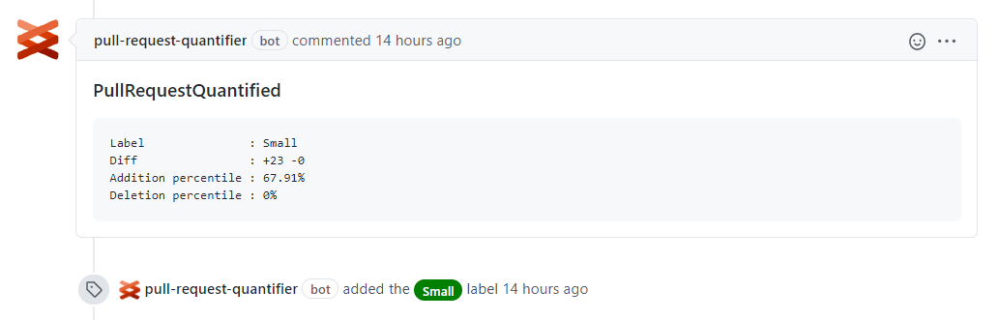

# GitHub client

## Installation

Install the [GitHub app](<link-to-app>) on your organization/repository.

The app will request certain permissions during the installation that enable it to 
read details of pull requests and the code itself.

## Usage

Upon creation or updates of pull requests, the app will evaluate it and label it with a size.

It will also put a comment on the pull request with more details about the result.

Sample output of a quantified GitHub pull request.

## Developing

TODO