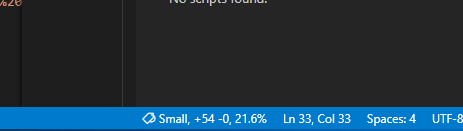
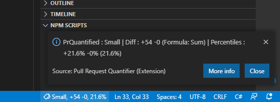

# Visual Studio Code client

## Installation

Install the VSCode extension either through the browser or from VSCode itself.

## Usage

Whenever a file is saved in VSCode, if that file is part of a git repo, the PullRequestQuantifier extension will evaluate changes
and display information in the status bar about how it is quantified.

Click on the info to show a more detailed output.

## Developing

TODO
